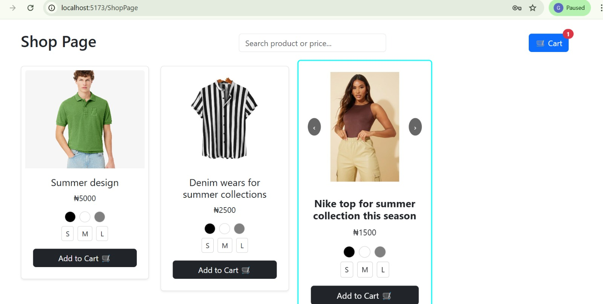
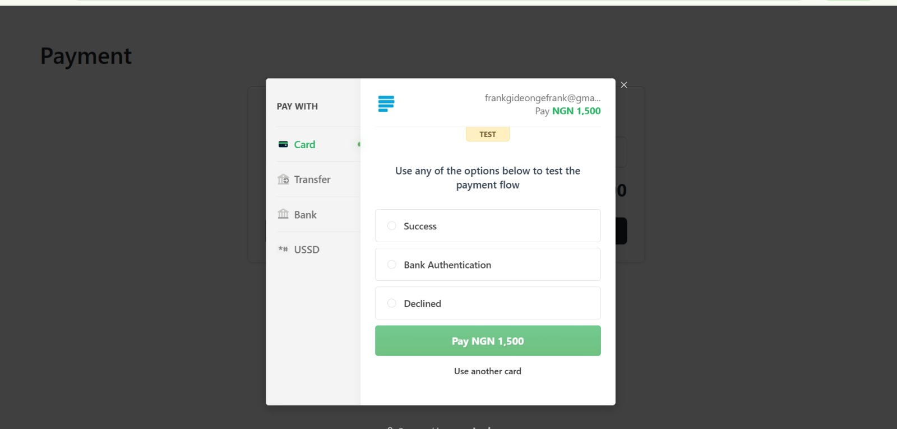
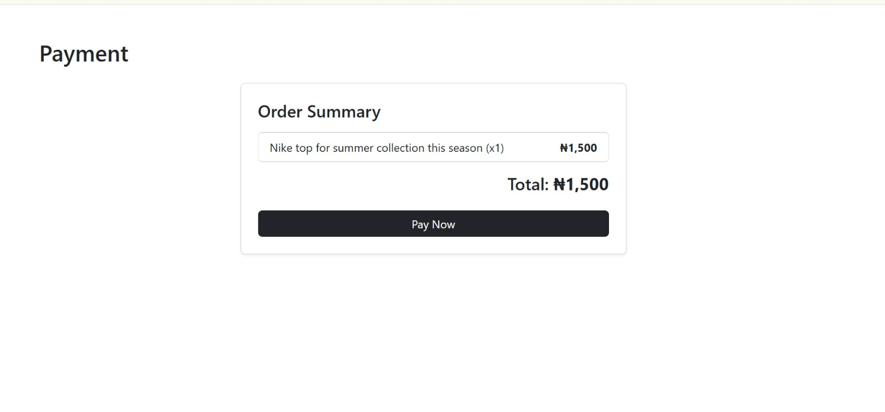
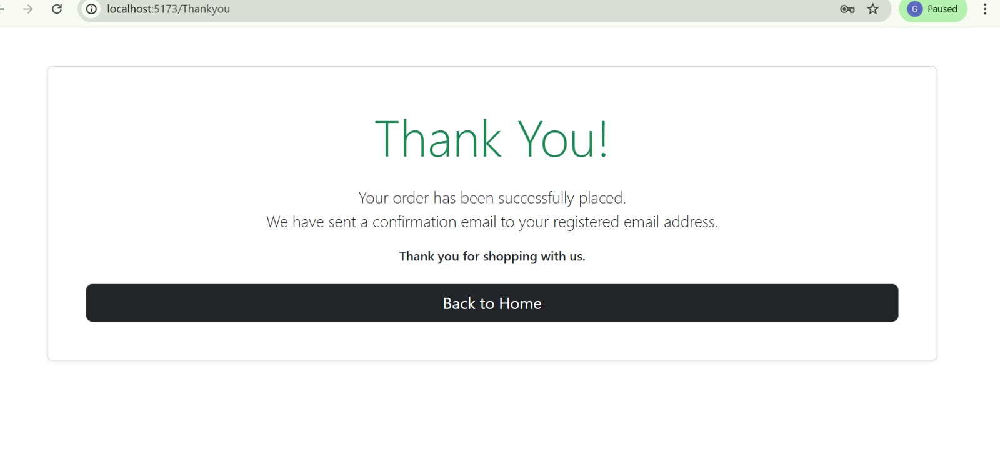

# MASCO Fashion E-commerce

## 📌 Project Overview

This is a full-stack e-commerce web application built with React (frontend) and Django REST Framework (backend). It allows users to browse products, add items to cart, place orders, and make payments.

## ⚠️ Live Demo

The live site is currently unavailable due to Netlify free plan usage limits.

## 📸 Screenshots

  
  
  
  

## 🚀 Features

- User authentication (JWT)  
- Product listing and details  
- Add to cart functionality  
- Order management system  
- Payment integration using Paystack  
- Responsive design with Bootstrap  

## 🛠️ Tech Stack

- Frontend: React, Bootstrap  
- Backend: Django, Django REST Framework  
- Database: SQLite / PostgreSQL  

## ⚙️ Installation Guide

### Clone the repository
```bash
git clone https://github.com/Gideonekibade123/torilolastproject1
Frontend setup
cd frontend
npm install
npm run dev
Backend setup
cd backend
pip install -r requirements.txt
python manage.py runserver
📂 Folder Structure
frontend → React app
backend → Django API
🧠 What I Learned
Building a full-stack application
Handling authentication with JWT
Integrating third-party payment (Paystack)
Deploying with Netlify and Render
⚠️ Note

This project was previously deployed on Netlify but is currently paused due to free-tier bandwidth limits.
